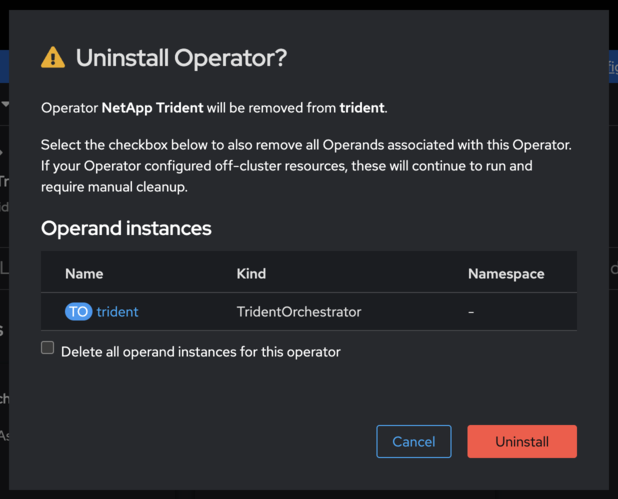

= Wechsel vom Trident Community Operator zum OpenShift Certified Operator
:hardbreaks:
:allow-uri-read: 
:icons: font
:imagesdir: ../media/

[role="lead"]
Um vom NetApp Community Trident Operator zum Red Hat OpenShift Certified Trident Operator zu wechseln, müssen Sie den Community Operator deinstallieren und dann den zertifizierten Operator mithilfe des OperatorHub installieren.

.Bevor Sie beginnen
Bevor Sie mit der Installation beginnen, link:../trident-get-started/requirements.html["Bereiten Sie Ihre Umgebung für die Trident Installation vor"].

== Deinstallieren Sie den NetApp Trident Community Operator

.Schritte
. Verwenden Sie die OpenShift-Konsole, um zum OperatorHub zu navigieren.
+
image::../media/openshift-operator-05.png[Installieren]

. Finden Sie den NetApp Trident Community Operator.
+

+

WARNING: Wählen Sie nicht *Alle Operandeninstanzen dieses Operators löschen* aus.

. Klicken Sie auf *Uninstall*.

== Installieren Sie den OpenShift zertifizierten Operator

.Schritte
. Navigieren Sie zum Red Hat OperatorHub.
. Suchen Sie nach dem NetApp Trident Operator und wählen Sie ihn aus.
+
image::../media/openshift-operator-05.png[Installieren]

. Folgen Sie den Anweisungen auf dem Bildschirm, um den Operator zu installieren.

== Überprüfung

* Überprüfen Sie den OperatorHub in der Konsole, um sicherzustellen, dass der neue zertifizierte Operator erfolgreich installiert wurde.

